# 科应 Scienceing 共享账号智能管理平台设计方案

## 1. 项目背景

目前拥有 10 个科应 Scienceing 账号，由管理员统一管理。

已确认科应平台存在以下行为：

1. 同一个账号在 B 电脑登录后，A 电脑原有会话会立即失效并返回登录页。
2. 管理员修改账号密码后，该账号现有登录会话立即失效。
3. 科应自身配置为连续 30 分钟无操作自动退出，用户产生操作后重新计时。
4. 管理员可直接重置账号密码，无验证码、短信验证或 MFA。
5. 重置密码成功后，科应会向账号绑定邮箱和手机号发送通知。
6. 当前没有可直接调用的科应开放 API。

因此，本系统不尝试破解或反向调用科应内部 API，而通过：

- 自建共享账号管理看板；
- Chrome / Edge 浏览器轻量扩展；
- 后端租约管理；
- Playwright 管理员网页自动化；

实现共享账号统一领取、使用状态展示、无操作自动释放和自动密码轮换。

---

# 2. 产品目标

系统最终解决四个问题。

### 2.1 所有人知道账号是否可用

员工访问统一看板即可看到：

- 总账号数量；
- 当前可用数量；
- 当前使用数量；
- 正在回收数量；
- 每个账号当前状态；
- 使用中的账号预计多久可能释放。

### 2.2 避免多人抢占同一个账号

用户不能自行从账号列表复制任意账号密码。

系统统一分配空闲账号，并通过数据库事务保证：

> 同一个科应账号同一时间只能存在一个有效租约。

### 2.3 准确判断连续 30 分钟无操作

由于科应没有开放 API，浏览器扩展只在科应页面工作，监听真实用户操作：

- pointer / click；
- keyboard；
- wheel / scroll；
- touch。

插件不采集：

- 搜索词；
- 文献内容；
- 用户输入内容；
- Cookie；
- 科应密码；
- 页面正文。

插件只上报：

> 某个 Lease 刚刚发生过真实用户操作。

### 2.4 自动释放账号

当后台确认：

```text
当前时间 - last_activity_at >= 30分钟
```

立即进入回收流程：

```text
ACTIVE
→ RECYCLING
→ Playwright重置密码
→ 科应旧Session立即失效
→ 保存新密码
→ AVAILABLE
```

---

# 3. 非目标

第一阶段明确不做：

- 不抓取科应数据库内容；
- 不监听用户搜索了什么；
- 不分析用户访问文献；
- 不逆向科应接口；
- 不监控浏览器其他网站；
- 不做复杂 AD/LDAP 集成；
- 不支持所有浏览器；
- 不建设微服务体系；
- 不上 Redis / Kafka 等额外基础设施；
- 不自动填写科应登录密码，第一版仍由用户复制；
- 不试图与科应自己的 30 分钟内部定时器完全同步。

本平台有自己独立的 30 分钟 Activity 规则。

---

# 4. 用户角色

系统设置三个角色。

| 角色 | 权限 |
|---|---|
| 游客 | 仅查看账号池整体可用情况 |
| 普通用户 | 登录、领取账号、查看自己的账号密码、打开科应、归还自己的账号 |
| 管理员 | 查看全部租约、账号管理、强制回收、手动重置密码、查看日志、管理用户 |

## 4.1 游客

无需登录即可看到：

```text
科应账号

总数       10
可用       6
使用中     3
回收中     1
```

但不显示：

- 科应密码；
- 使用员工姓名；
- 用户详细信息。

也不能领取。

---

# 5. 用户登录设计

由于当前公司 AD 接入流程较重，第一阶段不接 AD。

采用轻量本地身份系统。

## 5.1 用户表

管理员提前维护允许使用科应的员工：

```text
username
display_name
department
password_hash
role
enabled
```

例如：

```text
zhangsan
张三
研发部
USER
true
```

用户密码仅保存 Hash：

```text
Argon2id / bcrypt
```

绝不保存用户登录密码明文。

---

## 5.2 登录策略

首页公开。

点击：

```text
我要使用科应
```

如果未登录：

```text
登录
↓
成功
↓
检查浏览器插件
↓
领取账号
```

登录成功后建议保持 12 小时登录状态。

---

# 6. 核心架构

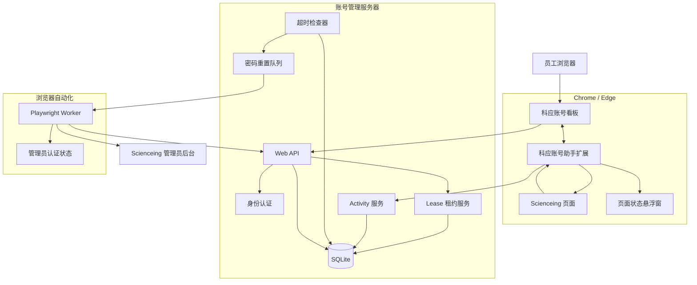

整个系统逻辑可以记成：

> **插件负责看，后台负责算，Playwright 负责干。**

Chrome 扩展本身支持向指定网页注入 content script，并允许扩展脚本修改/观察网页；Playwright 则支持基于页面 label、role、text 等定位器完成输入和点击。citeturn775940search3turn634050search0

---

# 7. 技术选型

## 7.1 Web

建议：

```text
Vue
+
Vite
```

主要页面只有：

```text
/
/login
/admin
```

不需要大型前端框架体系。

## 7.2 Backend

建议：

```text
Node.js
+
NestJS
```

## 7.3 数据库

第一阶段：

```text
SQLite
+
WAL
```

原因：

- 只有 10 个科应账号；
- 并发极低；
- 单机部署；
- 运维成本最低。


## 7.4 自动化

```text
Playwright
```

单 Worker 串行执行账号密码重置。

## 7.5 浏览器插件

```text
Manifest V3 WebExtension
```

第一阶段正式支持：

```text
Microsoft Edge
Google Chrome
```

采用 ZIP 分发 + 用户“加载已解压扩展”。

Edge 官方支持开发者模式加载本地 unpacked extension；后续如果进入正式企业部署阶段，可再切换为企业策略或内部扩展托管。citeturn634050search2

## 7.6 代码规范

统一使用 ESLint 进行代码规范检查。
优先使用github等社区已有模块，避免重复造轮子。
前端页面样式采用 Tailwind CSS 进行样式管理。组件化采用第三方库 shadcn UI。文档在 [shadcn UI](https://ui.shadcn.com/) 官网查看。
后端数据库采用分库分表 进行数据存储。
保证代码整洁简约，易于维护。

---

# 8. 浏览器扩展设计

插件名称建议：

> **科应共享账号助手**

## 8.1 插件职责

插件只承担四项职责。

### A. 检查插件状态

在账号看板页面注入脚本，让看板知道：

```text
插件已安装
version = 1.0.0
status = ready
```

### B. 建立 Lease 和科应 Tab 的绑定

```text
Tab 153
↓
Lease L-xxxx
↓
KY-03
```

### C. 监听页面真实操作

监听：

```text
pointerdown
keydown
wheel
touchstart
```

要求：

```javascript
event.isTrusted === true
```

尽量排除脚本自动产生的事件。

### D. 显示账号状态悬浮窗

直接注入 Scienceing 页面。

---

# 9. 插件不做什么

扩展权限必须保持最小。

插件禁止收集：

```text
科应搜索关键词
输入框内容
文献内容
网页HTML正文
Cookies
LocalStorage
科应账号密码
管理员密码
其他网站操作
```

它只发送：

```json
{
  "leaseToken": "...",
  "event": "activity"
}
```

甚至无需把事件类型发给后台。

---

# 10. 插件安装检测

因为采用手动 ZIP 安装，所以系统必须主动判断插件是否存在。

建议不要依赖固定 Extension ID。

让扩展同时在：

```text
账号看板域名
Scienceing域名
```

注入 Content Script。

访问看板时：

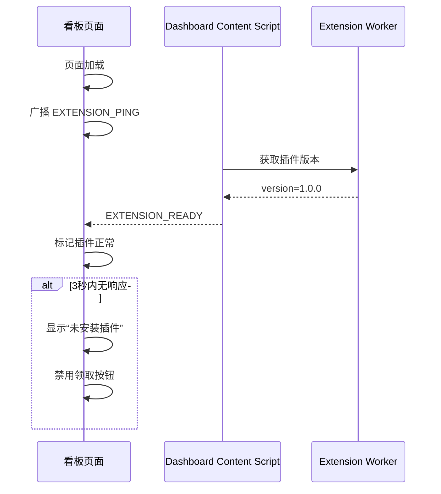

网页与扩展 Content Script 可以通过受控的 `window.postMessage` 协议通信；扩展内部再通过 Extension Runtime API 通信。Chrome Extensions API提供 runtime 等扩展生命周期及消息通信能力。citeturn775940search0

---

# 11. 插件版本控制

后端维护：

```text
latest_version
minimum_version
```

例如：

```text
latest = 1.2.0
minimum = 1.1.0
```

用户安装：

```text
1.0.0
```

则：

```text
插件版本过旧
↓
禁止领取账号
↓
提示下载安装最新版 ZIP
```

页面：

```text
⚠ 科应账号助手需要升级

当前版本：1.0.0
最低版本：1.1.0

[下载最新版]
```

---

# 12. 用户领取账号

用户不能自己选择 KY-01、KY-02。

点击：

```text
我要使用科应
```

由后台自动选择可用账号。

## 12.1 领取流程

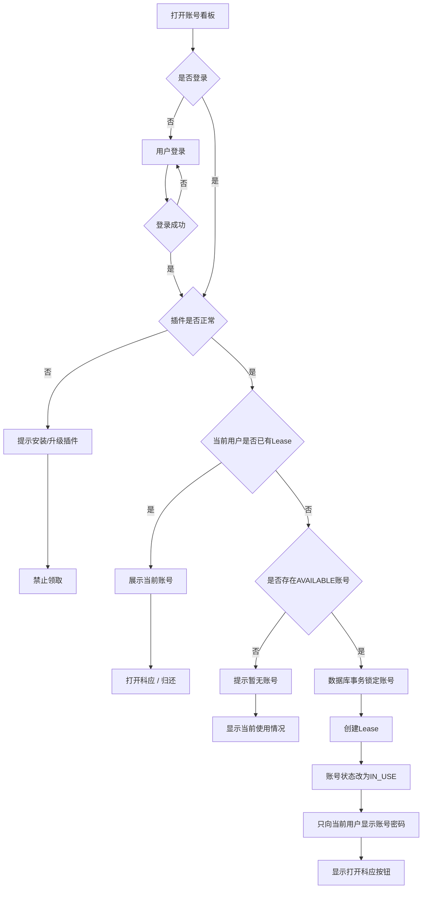

---

# 13. 防止两个员工同时领取同一个账号

必须由数据库完成原子操作。

禁止：

```text
SELECT available account
↓
返回前端
↓
前端选择
↓
UPDATE
```

应该：

```text
BEGIN

选择一个AVAILABLE账号
↓
UPDATE status = IN_USE
↓
INSERT lease
↓
COMMIT
```

只有事务成功以后才返回密码。

---

# 14. 一个员工只能占一个账号

业务规则：

```text
每个 user
active lease <= 1
```

如果张三已经拥有 KY-03：

再次点击：

```text
我要使用科应
```

不能再发 KY-05。

而是显示：

```text
你当前正在使用

KY-03

最后操作：3分钟前
自动释放：27:14

[打开科应]
[立即归还]
```

---

# 15. 从看板打开科应

这是插件识别账号的关键。

不能单纯：

```javascript
window.open(scienceingUrl)
```

而应该：

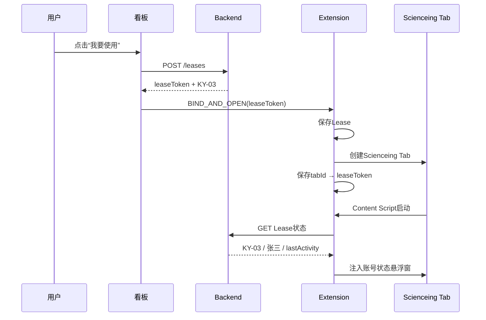

因此插件无需读取 Scienceing 页面判断登录账号。

系统关系是：

```text
Lease
↓
已经知道 account_id
↓
Extension
↓
绑定 Scienceing Tab
```

---

# 16. 多标签页处理

用户可能：

```text
Scienceing首页
↓
Ctrl + 点击
↓
打开文献新Tab
```

扩展后台维护：

```text
Lease L-001

Tab 101
Tab 102
Tab 105
```

如果新标签存在：

```text
openerTabId
```

而 opener 已属于某 Lease：

```text
新Tab自动继承Lease
```

如果无法确认：

插件显示：

```text
⚠ 当前科应页面未与账号租约绑定

请从“科应账号看板”重新打开。
```

未绑定页面产生的 Activity 不参与续期。

---

# 17. 什么算“用户操作”

定义非常重要。

## 17.1 算有效 Activity

```text
pointerdown
keydown
wheel
touchstart
```

满足：

```text
event.isTrusted == true
```

## 17.2 不算 Activity

```text
mousemove
页面单纯保持打开
Tab获取焦点
插件自己倒计时
插件提醒弹窗操作
页面后台定时刷新
网页脚本触发事件
```

尤其不监听：

```text
mousemove
```

避免大量无意义事件和鼠标防休眠工具导致账号永远不释放。

---

# 18. Activity 上报机制

不要每次操作都请求服务器。

插件本地维护：

```text
lastLocalActivity
pendingActivity
```

用户连续：

```text
点击
滚动
点击
键盘
滚动
```

插件只记录：

```text
有操作
```

最多每约 5～10 秒向服务器发送一次 Activity。

如果没有操作：

```text
什么都不发送
```

注意这与 heartbeat 完全不同。

Heartbeat：

```text
页面开着
→ 一直上报
```

是错误设计。

Activity：

```text
真实操作
→ 才上报
```

才符合需求。

---

# 19. 后台只相信服务器时间

插件禁止自己决定：

```text
last_activity_at = 11:23
```

插件只说：

```text
我刚才发生了Activity
```

后台收到后：

```text
last_activity_at = database NOW()
```

避免用户修改电脑时间或伪造时间戳。

---

# 20. 科应页面状态悬浮窗

插件在科应页面右下角注入 Shadow DOM UI，避免被科应自己的 CSS 污染。

## 20.1 正常状态

```text
┌────────────────────────┐
│ 🟢 科应共享账号          │
│                        │
│ KY-03                  │
│ 张三                   │
│                        │
│ 无操作：02:14           │
│ 预计释放：27:46         │
│                        │
│ [立即归还]              │
└────────────────────────┘
```

可折叠：

```text
┌────────────────┐
│ 🟢 KY-03 27:46 │
└────────────────┘
```

---

# 21. 即将释放提醒

## 21.1 25分钟

悬浮窗变为警告状态：

```text
⚠ 已连续25分钟无操作

04:59后自动释放账号

继续操作科应页面即可保持使用。
```

不强制弹 Modal。

## 21.2 29分钟

弹一次提醒：

```text
┌────────────────────────────┐
│ ⚠ 科应账号即将自动释放      │
│                            │
│ 已连续29分钟无操作          │
│                            │
│ 00:59 后自动释放            │
│                            │
│ 继续操作页面即可保持使用。   │
│                            │
│              [立即归还]     │
└────────────────────────────┘
```

操作这个插件 Modal 本身：

```text
不能续期
```

只有操作 Scienceing 页面才续期。

---

# 22. Activity续期流程

```mermaid
sequenceDiagram
    participant U as 用户
    participant S as Scienceing页面
    participant C as Content Script
    participant E as Extension Worker
    participant API as Activity API
    participant DB as Database

    U->>S: 点击/键盘/滚轮
    S->>C: Trusted Event

    C->>C: 判断event.isTrusted
    C->>C: 排除插件UI

    C->>E: activity(leaseToken)

    E->>E: 5~10秒节流合并

    E->>API: POST /leases/{id}/activity

    API->>DB: 校验Lease仍为ACTIVE

    alt Lease有效
        API->>DB: last_activity_at = NOW()
        API-->>E: ACTIVE + expiresAt
        E-->>S: 更新倒计时
    else Lease已回收
        API-->>E: LEASE_EXPIRED
        E-->>S: 显示已释放
    end
```

---

# 23. 账号状态机

账号保持少量明确状态：

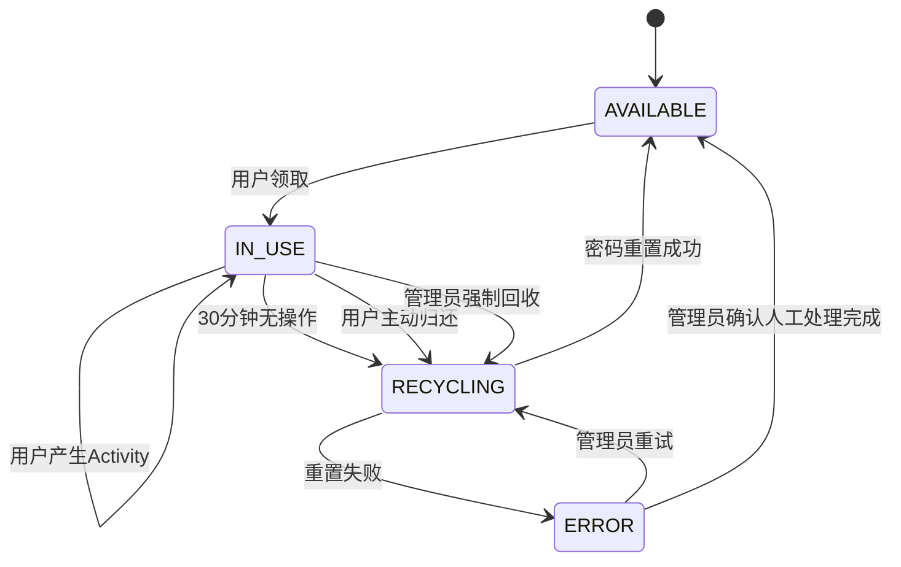

只使用四个核心状态：

```text
AVAILABLE
IN_USE
RECYCLING
ERROR
```

---

# 24. Lease 状态

Lease 与 Account 状态分开。

```text
ACTIVE
RELEASE_REQUESTED
RECYCLING
RELEASED
FAILED
```

例如：

```text
Account KY-03
status = IN_USE

Lease L123
status = ACTIVE
```

回收后：

```text
Account KY-03
status = AVAILABLE

Lease L123
status = RELEASED
released_reason = INACTIVITY_TIMEOUT
```

---

# 25. 30分钟自动释放核心流程

后台每 10～30 秒检查一次：

```text
status = ACTIVE
AND
last_activity_at <= NOW() - 30分钟
```

发现满足条件以后，必须用原子条件更新：

```text
ACTIVE
→
RECYCLING
```

确保只有一个 Worker 获得回收权。

---

# 26. 自动释放交互流程

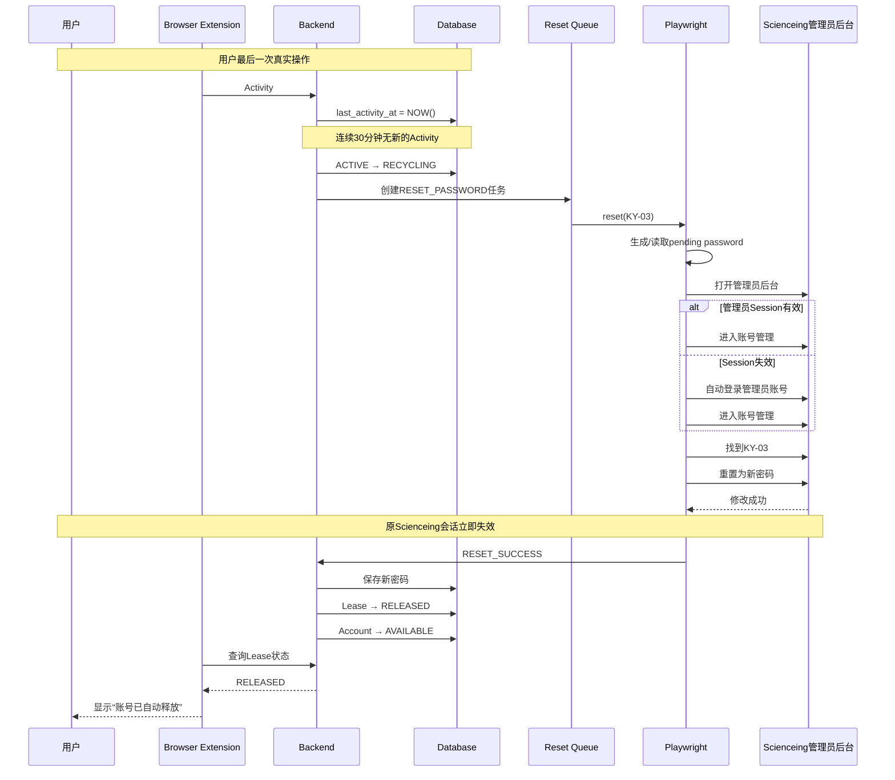

---

# 27. 为什么使用 Playwright

Playwright不是调用科应隐藏 API。

它本质上模拟管理员正常操作：

```text
打开后台
↓
登录
↓
进入用户管理
↓
找到账号
↓
点击重置密码
↓
填写新密码
↓
保存
↓
验证成功提示
```

优先使用：

```text
getByRole()
getByLabel()
getByText()
```

而不是长 CSS/XPath。

Playwright 官方也推荐优先使用面向用户语义的 role、label 等 Locator，因为它们通常比依赖 DOM 层级的 CSS/XPath 更稳定。citeturn634050search0

---

# 28. Playwright Worker设计

只运行：

```text
1个Worker
```

所有密码任务进入队列：

```text
RESET KY-03
RESET KY-07
RESET KY-02
```

Worker：

```text
KY-03
↓
完成
↓
KY-07
↓
完成
↓
KY-02
```

不并行登录管理员账号。

避免管理员账号自身发生会话互踢。

---

# 29. 管理员认证状态

第一次由管理员正常登录。

保存：

```text
playwright/.auth/admin.json
```

Worker启动后加载认证状态。

Playwright支持复用浏览器认证状态，但认证文件可能含能够冒充管理员身份的 Cookies/Header，因此必须作为高敏感文件保护，并明确排除出 Git。citeturn634050search1

目录：

```text
playwright/
└── .auth/
    └── admin.json
```

加入：

```text
.gitignore
```

如果状态过期：

```text
访问账号管理页
↓
发现返回登录页
↓
自动重新登录
↓
继续任务
```

---

# 30. 密码重置必须使用两阶段机制

不要先修改数据库再操作科应。

正确流程：

## Phase 1

```text
生成newPassword

Account:
current_password = OLD
pending_password = NEW
status = RECYCLING
```

## Phase 2

Playwright成功：

```text
Scienceing密码 = NEW
```

数据库：

```text
current_password = NEW
pending_password = null
status = AVAILABLE
```

失败：

```text
current_password = OLD
pending_password = NEW/NULL
status = ERROR
```

管理员介入。

---

# 31. Playwright成功判断

禁止：

```text
点击“确定”
=
认为成功
```

必须检查：

```text
修改成功
```

之类的成功状态。

例如概念：

```javascript
await page.getByRole("button", { name: "确定" }).click();

await expect(
  page.getByText("修改成功")
).toBeVisible();
```

只有验证成功后才提交数据库密码更新。

---

# 32. 主动归还流程

用户不需要等 30 分钟。

科应页面悬浮窗：

```text
[立即归还]
```

或者看板：

```text
[归还账号]
```

流程：

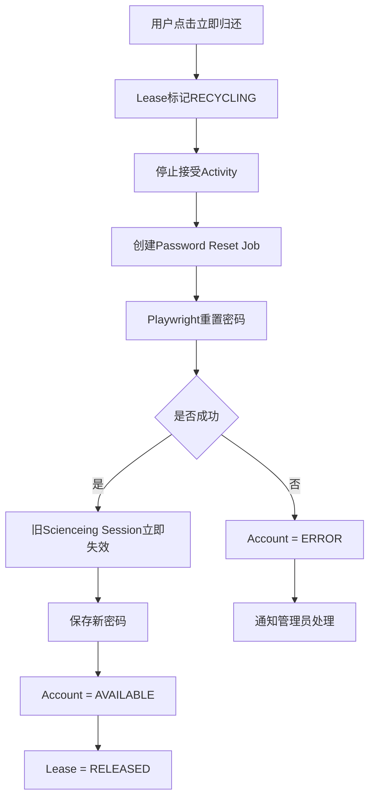

---

# 33. 自动回收竞争条件

一个重要场景：

```text
29:59.900 用户点击了一下
30:00.000 Scheduler准备回收
```

系统必须避免：

```text
刚操作
↓
还是被踢
```

处理方式：

Scheduler执行原子条件更新：

```sql
UPDATE leases
SET status = 'RECYCLING'
WHERE id = ?
  AND status = 'ACTIVE'
  AND last_activity_at <= threshold;
```

只有更新成功才真正回收。

Activity API同样：

```text
只有status = ACTIVE
才能更新last_activity
```

一旦进入：

```text
RECYCLING
```

再收到 Activity 不再续期。

---

# 34. 建议的释放时间误差

插件 Activity 采用约 5～10 秒节流，因此：

```text
真正最后操作
→
服务器知道
```

误差通常不超过数秒。

建议业务定义：

> 连续约 30 分钟没有有效操作自动释放。

不要承诺毫秒级精确等同于科应自己的 Session 定时器。

---

# 35. 账号池看板

首页建议：

```text
┌───────────────────────────────────────────┐
│ 科应共享账号                              │
│                                           │
│ 可用 6      使用中 3      回收中 1       │
├───────────────────────────────────────────┤
│                                           │
│ KY-01      🟢 可用                        │
│ KY-02      🔴 使用中   预计28分钟后释放    │
│ KY-03      🔴 使用中   预计11分钟后释放    │
│ KY-04      🟠 正在回收                    │
│ KY-05      🟢 可用                        │
│                                           │
│             [我要使用科应]                │
└───────────────────────────────────────────┘
```

未登录用户：

```text
不展示具体使用人
```

登录后可根据内部需求显示：

```text
张三正在使用
```

或者继续匿名：

```text
使用中
```

第一版推荐匿名，减少不必要的信息暴露。

---

# 36. 用户自己的租约页面

领取成功：

```text
┌──────────────────────────────┐
│ 已分配科应账号                │
│                              │
│ KY-03                        │
│ 密码：••••••••••••           │
│                              │
│ [复制账号]   [复制密码]       │
│                              │
│        [打开科应]             │
│                              │
│ 最后操作：2分钟前             │
│ 预计自动释放：28:04           │
│                              │
│        [立即归还]             │
└──────────────────────────────┘
```

密码默认隐藏。

只有点击：

```text
显示
复制
```

时短暂显示。

---

# 37. 管理后台

路由：

```text
/admin
```

包含：

## 账号管理

```text
KY-01  AVAILABLE
KY-02  IN_USE       张三
KY-03  RECYCLING
KY-04  ERROR
```

操作：

```text
强制回收
手动重置密码
标记可用
禁用账号
```

## 用户管理

```text
创建用户
禁用用户
重置登录密码
管理员角色
```

## 租约记录

```text
领取人
科应账号
领取时间
最后操作
释放时间
释放原因
```

## 系统日志

```text
LOGIN
CLAIM_ACCOUNT
ACTIVITY
RELEASE
TIMEOUT
RESET_PASSWORD
RESET_SUCCESS
RESET_FAILED
ADMIN_FORCE_RELEASE
```

---

# 38. 页面路由建议

```text
/
    公开账号池

/login
    登录

/my
    我的当前Lease

/admin/accounts
    科应账号管理

/admin/users
    用户管理

/admin/leases
    租约历史

/admin/logs
    操作日志

/admin/settings
    系统参数
```

---

# 39. 数据库设计

## users

```text
id
username
display_name
department
password_hash
role
enabled
created_at
updated_at
```

---

## scienceing_accounts

```text
id
code
username

current_password_ciphertext
pending_password_ciphertext

status

last_password_changed_at
enabled

created_at
updated_at
```

---

## leases

```text
id
lease_token_hash

account_id
user_id

status

started_at
last_activity_at

release_requested_at
released_at

release_reason

extension_version

created_at
updated_at
```

`release_reason`：

```text
USER_RETURN
INACTIVITY_TIMEOUT
ADMIN_FORCE
RESET_ERROR
```

---

## reset_jobs

```text
id
account_id
lease_id

status

attempt_count
error_message

created_at
started_at
finished_at
```

状态：

```text
PENDING
RUNNING
SUCCESS
FAILED
```

---

## audit_logs

```text
id

user_id
account_id
lease_id

action
result

ip
user_agent

metadata

created_at
```

metadata禁止保存科应密码。

---

## system_settings

```text
key
value
```

例如：

```text
inactivity_timeout_seconds = 1800
warning_seconds = 300
critical_warning_seconds = 60
extension_min_version = 1.0.0
```

---

# 40. API设计

## 登录

```text
POST /api/auth/login
POST /api/auth/logout
GET  /api/auth/me
```

---

## 账号池

```text
GET /api/accounts/availability
```

游客即可访问，只返回：

```json
{
  "total": 10,
  "available": 6,
  "inUse": 3,
  "recycling": 1
}
```

---

## Lease

```text
POST /api/leases
GET  /api/leases/current
POST /api/leases/{id}/activity
POST /api/leases/{id}/release
GET  /api/leases/{id}/status
```

---

## 插件

```text
GET /api/extension/config
```

返回：

```json
{
  "minimumVersion": "1.0.0",
  "activityThrottleSeconds": 5,
  "warningSeconds": 300
}
```

---

## 管理员

```text
GET  /api/admin/accounts
POST /api/admin/accounts/{id}/force-release
POST /api/admin/accounts/{id}/reset-password

GET  /api/admin/leases
GET  /api/admin/logs

POST /api/admin/users
PATCH /api/admin/users/{id}
```

---

# 41. 密码安全

这里存在两种完全不同的密码。

## 员工看板登录密码

只保存：

```text
password_hash
```

无法反向解密。

## 科应账号密码

系统必须以后重新提供给用户，所以不能 Hash。

必须：

```text
可解密加密存储
```

推荐：

```text
AES-256-GCM
+
独立Master Key
```

如果运行服务器为 Windows，也可以进一步利用 Windows 本机密钥保护能力保存 Master Key。

数据库只保存：

```text
ciphertext
iv
authTag
```

---

# 42. 科应管理员凭据

管理员凭据属于最高敏感等级。

不能：

```javascript
const password = "123456";
```

不能存在：

```text
config.json
Git
前端
数据库普通字段
```

应放在：

```text
服务器 Secret / Environment
```

并限制只有 Playwright Worker 能访问。

Playwright 的已登录认证状态同样属于高敏感 Secret。citeturn634050search1

---

# 43. Lease Token

插件不要保存：

```text
用户密码
科应密码
```

只保存一个短期随机：

```text
leaseToken
```

例如使用高强度随机值。

后端数据库只保存：

```text
SHA-256(leaseToken)
```

类似 API Token 管理。

Lease结束：

```text
token立即失效
```

---

# 44. 插件页面浮窗安全

建议使用：

```text
Shadow DOM
```

作为插件组件根节点。

例如：

```text
#__scienceing_account_assistant__
```

所有 Activity Listener 都判断：

```text
事件是否来自插件UI
```

来自插件UI：

```text
return
```

避免：

```text
点击“立即归还”
```

反而把 Lease 自动续期。

---

# 45. 网络异常

场景：

```text
用户正在使用科应
↓
账号管理服务器断网
```

插件无法上报 Activity。

不能马上把账号释放。

建议策略：

```text
服务器失联
↓
插件浮窗显示
“账号管理服务连接异常”
```

后台恢复以后依据最后已知 Activity 计算。

第一版建议：

> 系统不可用时禁止新领取；已有 Lease 不因短暂服务中断立即强制回收。

防止服务器故障造成批量用户被踢。

---

# 46. 插件异常

如果插件本身异常：

```text
看板检测不到插件
↓
禁止领取新账号
```

如果已有 Lease 使用过程中插件被用户关闭：

后台自然不会再收到 Activity。

30分钟后：

```text
自动释放
```

这是可以接受的。

用户等于主动放弃了“保持账号占用”的能力。

---

# 47. Playwright失败

例如：

```text
科应页面改版
管理员Session失效
网络失败
账号找不到
保存按钮改变
```

执行：

```text
RECYCLING
↓
RESET_FAILED
↓
Account = ERROR
```

禁止：

```text
ERROR
→
自动AVAILABLE
```

因为此时不知道真实密码状态。

管理员后台显示：

```text
⚠ KY-03 自动回收失败

错误：
未找到“重置密码”按钮

[重试]
[人工处理完成]
```

---

# 48. Playwright重试策略

推荐：

```text
第一次失败
↓
等待数秒
↓
重新打开管理页
↓
再尝试一次
```

最多：

```text
2～3次
```

仍失败：

```text
ERROR
```

不要无限重试。

---

# 49. 科应页面改版检测

Playwright自动化最大的长期风险就是：

> 科应管理页面发生变化。

因此需要：

```text
健康检查
```

管理员后台显示：

```text
Scienceing Automation

✅ 管理员登录正常
✅ 用户管理页面可访问
✅ Password Reset入口正常

最后检测：
2026-08-31 10:35
```

也可以每天执行一次无修改的检查：

```text
登录
↓
进入账号管理
↓
确认关键元素存在
↓
退出
```

不实际改密码。

---

# 50. 短信和邮件通知问题

目前每次密码重置都会通知该账号绑定的：

```text
邮箱
手机号
```

由于自动回收可能造成大量通知，应单独作为运营问题处理。

建议优先与科应供应方确认：

```text
是否可以关闭改密通知
是否允许统一绑定管理员邮箱
是否允许统一绑定管理员手机号
是否存在共享账号专用配置
```

如果通知无法关闭，系统技术上仍可运行，但要接受：

> 每次超时、主动归还、强制回收都可能产生通知。

---

# 51. 完整用户交互闭环

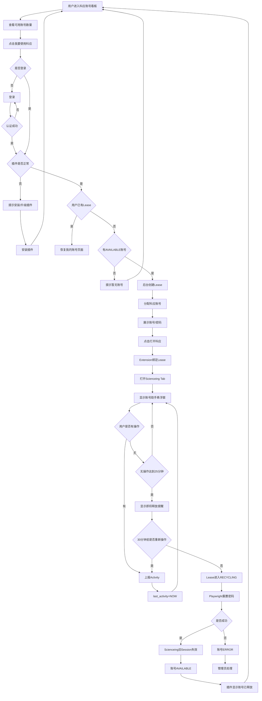

---

# 52. 管理员强制回收流程

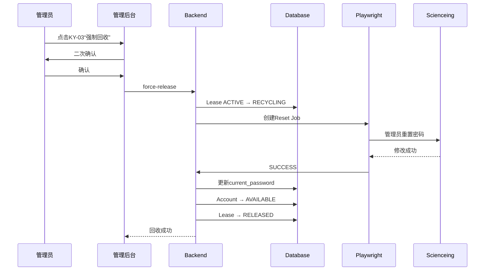

---

# 53. 插件安装交互

第一版支持：

```text
Edge
Chrome
```

用户下载：

```text
科应共享账号助手_v1.0.0.zip
```

安装说明：

```text
1. 下载 ZIP

2. 解压到固定目录，例如：
   C:\ScienceingAssistant\

3. Edge：
   edge://extensions

   Chrome：
   chrome://extensions

4. 开启开发人员模式

5. 点击“加载已解压的扩展程序”

6. 选择：
   C:\ScienceingAssistant\

7. 返回账号看板

8. 页面自动检测插件
```

禁止用户安装后删除：

```text
C:\ScienceingAssistant
```

因为 unpacked extension 依赖原目录。

---

# 54. 看板插件状态

正常：

```text
科应共享账号助手

✅ 已安装
✅ 版本 1.0.0
✅ 后台通信正常
```

异常：

```text
❌ 未检测到科应共享账号助手

安装插件后才能领取账号。

[下载插件]
[安装教程]
```

旧版本：

```text
⚠ 插件版本过旧

当前：1.0.0
最低：1.1.0

[下载最新版]
```

---

# 55. 部署架构

第一阶段推荐单机。

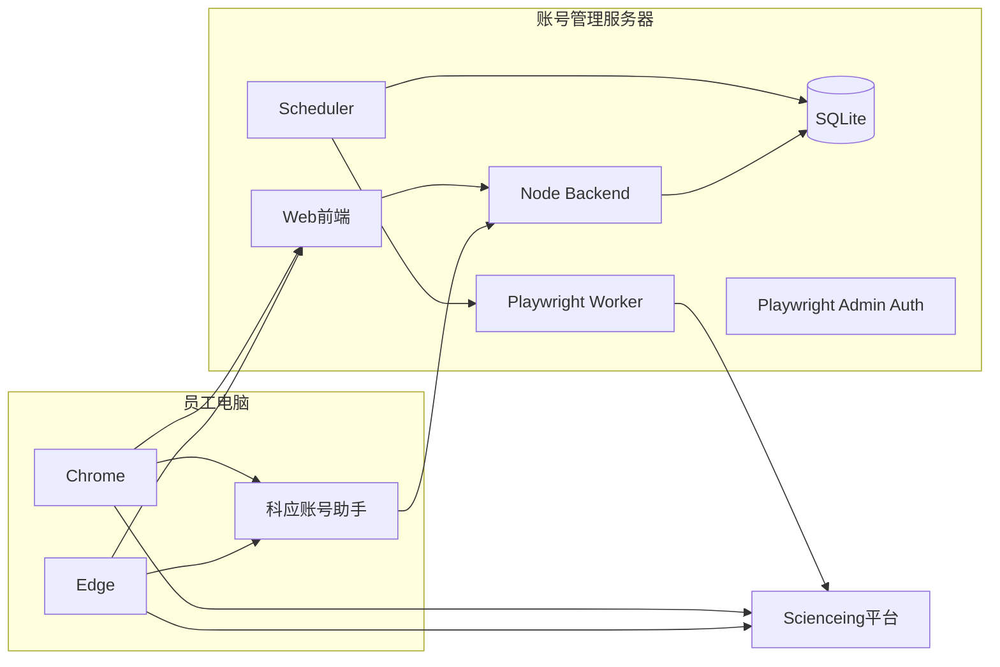

一个项目即可：

```text
scienceing-account-manager/
├── apps/
│   ├── web/
│   ├── server/
│   └── extension/
│
├── packages/
│   └── shared/
│
├── playwright/
│   ├── worker/
│   └── .auth/
│
├── data/
│   └── scienceing.db
│
└── deployment/
```

不拆微服务。

---

# 56. 后端模块建议

```text
AuthModule
UserModule
AccountModule
LeaseModule
ActivityModule
ResetModule
AutomationModule
AuditModule
ExtensionModule
AdminModule
```

职责：

```text
AuthModule
    登录认证

AccountModule
    10个科应账号状态

LeaseModule
    领取/归还

ActivityModule
    用户活动续期

ResetModule
    密码回收Job

AutomationModule
    Playwright实现

AuditModule
    操作日志

ExtensionModule
    插件版本和配置
```

---

# 57. 系统关键业务规则

必须写死以下规则：

### R1

同一个科应账号：

```text
最多一个ACTIVE Lease
```

### R2

同一个普通用户：

```text
最多一个ACTIVE Lease
```

### R3

插件未正常安装：

```text
禁止领取
```

### R4

插件版本低于 minimum：

```text
禁止领取
```

### R5

只有真实 Activity：

```text
续期30分钟
```

### R6

30分钟无 Activity：

```text
强制回收
```

### R7

进入 RECYCLING 后：

```text
不接受续期
```

### R8

Playwright改密成功：

```text
才能AVAILABLE
```

### R9

Playwright失败：

```text
必须ERROR
```

### R10

普通用户：

```text
永远只能看到自己当前Lease对应密码
```

---

# 58. 日志与审计

必须记录：

```text
用户登录
用户登出
账号领取
插件版本
Scienceing打开
Activity最后更新时间
用户主动归还
自动超时
管理员强制回收
Playwright开始
Playwright失败
Playwright成功
密码修改时间
管理员人工修复
```

但禁止记录：

```text
科应密码明文
管理员密码
搜索词
页面内容
用户输入内容
```

---

# 59. MVP开发阶段划分

## Phase 1：账号池

先完成：

```text
登录
10个账号录入
账号状态
领取
归还
事务锁
管理员页面
日志
```

暂时手动改密码。

目标：

> 证明账号池分配逻辑成立。

---

## Phase 2：浏览器插件

完成：

```text
插件安装检测
Lease绑定
从看板打开Scienceing
Scienceing状态浮窗
Activity监听
last_activity
30分钟倒计时
```

暂时到期只：

```text
标记为待回收
```

目标：

> 验证“30分钟无操作判断”是否可靠。

---

## Phase 3：Playwright

完成：

```text
管理员登录
storageState
账号定位
密码重置
结果校验
Reset Queue
ERROR状态
```

目标：

> 跑通自动改密。

---

## Phase 4：闭环

接通：

```text
30分钟无操作
↓
RECYCLING
↓
Playwright
↓
修改密码
↓
旧Session失效
↓
AVAILABLE
```

此时整个系统具备正式试点能力。

---

# 60. 第一版验收标准

满足以下测试即可认为 MVP 成功。

### 场景1：正常领取

```text
A登录
↓
领取KY-01
↓
B不能领取KY-01
```

### 场景2：一个人不能多占

```text
A已有KY-01
↓
再次领取
↓
系统返回KY-01
```

### 场景3：插件检测

```text
插件关闭
↓
无法领取
```

### 场景4：正常Activity

```text
用户第29分钟滚动Scienceing
↓
倒计时恢复约30分钟
```

### 场景5：页面挂机

```text
打开Scienceing
↓
30分钟完全无操作
↓
自动回收
```

### 场景6：浏览器关闭

```text
最后Activity
↓
关闭浏览器
↓
30分钟后自动回收
```

### 场景7：主动归还

```text
点击立即归还
↓
Playwright改密
↓
旧Session立即失效
↓
AVAILABLE
```

### 场景8：自动回收

```text
30分钟无操作
↓
自动改密
↓
原Scienceing页面被踢
↓
其他用户可重新领取
```

### 场景9：改密失败

```text
Playwright失败
↓
账号ERROR
↓
不能重新分配
```

### 场景10：并发领取

两个用户同时领取最后一个账号：

```text
只有一个人成功
```

---

# 61. 最终业务闭环

整个系统最终可以抽象成：

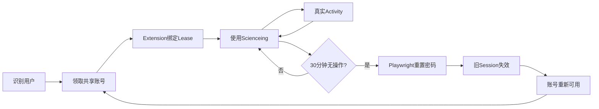

---

# 62. 最终方案定义

本项目最终不是：

> Scienceing 在线状态监控平台。

因为没有科应开放接口，没有必要伪造“服务器真实在线状态”。

它应该定义为：

> **Scienceing 共享账号租约管理与自动回收平台。**

其中：

```text
看板
=
账号资源入口

Lease
=
谁拥有当前账号使用权

浏览器插件
=
判断该Lease是否存在真实操作

30分钟计时器
=
决定Lease是否失效

Playwright
=
自动执行管理员密码重置

修改密码
=
强制结束原Scienceing Session

AVAILABLE
=
重新进入账号池
```

形成：

```text
领取
→ 使用
→ Activity续期
→ 30分钟无操作
→ 自动改密
→ 强制退出
→ 自动释放
→ 下一个人领取
```
